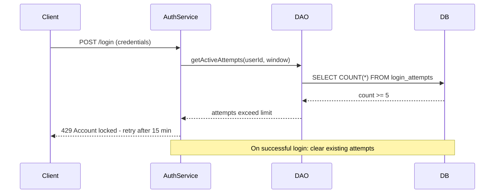

# Login Lockout Implementation

> [!abstract] Account Lockout Mechanism
> Implements rate limiting on authentication to prevent brute-force attacks.

---

## Configuration

| Parameter | Value |
|---|---|
| Max Failed Attempts | 5 attempts |
| Lockout Duration | 15 minutes |
| Cleanup Strategy | Automatic expiration |
| Window | Rolling 15-minute window |

---

## Components

```
back-end/
├── src/
│   ├── db/
│   │   └── models/
│   │       └── loginAttempt.js         # Sequelize model
│   ├── DAOs/
│   │   └── loginAttempt.dao.js         # Data access object
│   ├── services/
│   │   └── authService.js             # Lockout logic
│   └── middleware/
│       └── rateLimit.js              # Rate limiting
```

---

## Flow



---

## Database Tracking

- Table: `login_attempts`
- Tracks: `user_id`, `ip_address`, `created_at`
- Auto-expires entries older than lockout window
- Indexed for performance

### DAO Methods
- `getActiveAttempts(userId, windowMs)` — count recent failures
- `recordAttempt(userId, ip)` — insert new failure record
- `clearAttempts(userId)` — wipe on successful login

---

## Frontend Integration

- Displays countdown timer during lockout
- Non-intrusive error messaging
- Disables submit button during lockout
- Reads lockout remaining time from 429 response headers or body

---

## Combined with Rate Limiting

- `rateLimit.js` middleware provides second layer of protection
- Login endpoint has stricter limits than general API
- IP-based tracking complements user-based lockout
