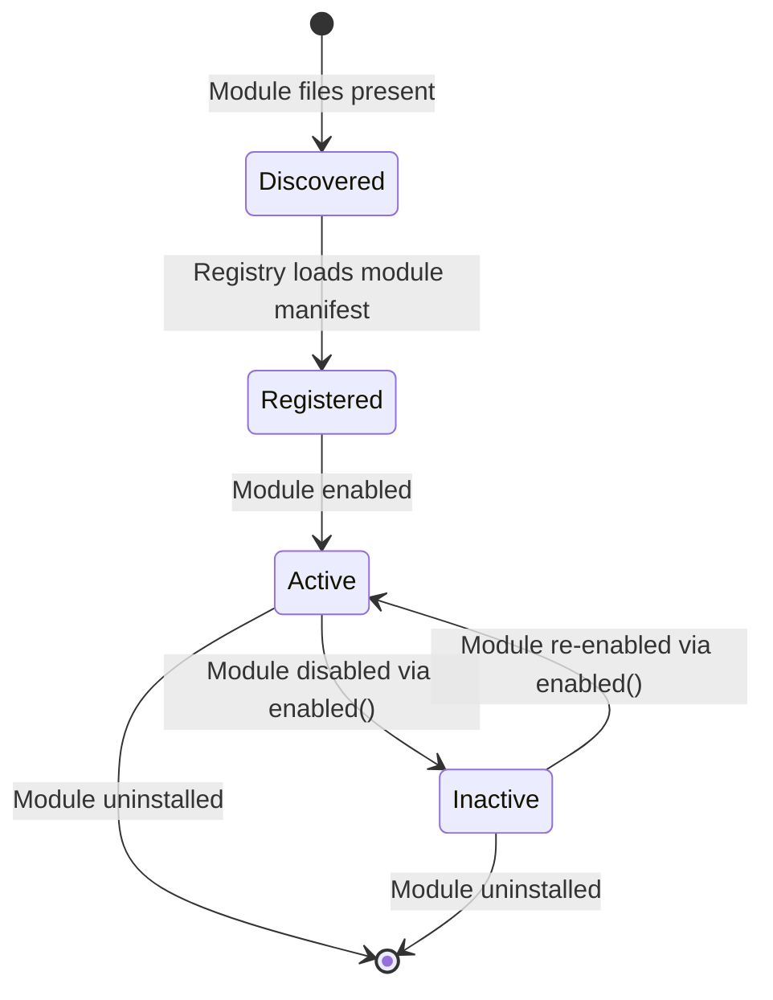

# Phase 2 Architecture Diagrams

## Tenant Resolution & Routing

```mermaid
flowchart LR
    A[Incoming Request] --> B{Tenant identifier provided?}
    B -->|No| C[Public route (no tenant context)]
    B -->|Yes| D[resolveTenant middleware]
    D --> E{Tenant found?}
    E -->|No| F[404 Tenant Not Found]
    E -->|Yes| G[requireActiveTenant]
    G --> H{Tenant active?}
    H -->|No| I[403 Suspended/PastDue]
    H -->|Yes| J[Attach req.tenant]
    J --> K[Route Handler]
    K --> L{Feature Guard?}
    L -->|Required| M{Feature enabled?}
    M -->|No| N[404 Feature disabled]
    M -->|Yes| O[Execute Handler]
    L -->|Not required| O
    O --> P[JSON Response]
```

> **Note:** Tenant resolution is always active. There is no single-tenant mode toggle.

## Module System Topology

```mermaid
flowchart TB
    subgraph Platform [Platform Core]
        A[server.js] --> B[Module Registry]
        B --> C[Vertical + Module mounting]
    end

    subgraph Registry [Module Registry]
        B --> E[tenant-platform module]
        B --> F[restaurant vertical module]
        B --> G[salon vertical module]
    end

    subgraph TenantPlatform [Tenant-Platform Module]
        E --> E1[resolveTenant]
        E --> E2[tenantStatus]
        E --> E3[featureGuard]
        E --> E4[60+ route files]
        E --> E5[45+ DAOs]
        E --> E6[Subscription + Billing]
    end

    subgraph Restaurant [Restaurant Vertical Module]
        F --> F1[requireVertical restaurant]
        F --> F2[20+ route files]
        F --> F3[15+ DAOs]
        F --> F4[Reservations/Tables/Schedule]
        F --> F5[Waitlist/Heatmap/No-shows]
    end

    subgraph Salon [Salon Vertical Module]
        G --> G1[requireVertical salon]
        G --> G2[17 route files]
        G --> G3[16 DAOs]
        G --> G4[Appointments/Stations/Services]
        G --> G5[Walk-ins/Recurring/WhatsApp]
    end

    style Platform fill:#f9f,stroke:#333,stroke-width:2px
    style Registry fill:#bbf,stroke:#333,stroke-width:2px
    style TenantPlatform fill:#bfb,stroke:#333,stroke-width:2px
    style Restaurant fill:#fbb,stroke:#333,stroke-width:2px
    style Salon fill:#fbb,stroke:#333,stroke-width:2px
```



> **Note:** Restaurant and salon are peer verticals under `back-end/src/verticals/`. All modules are always loaded at startup; there is no `TENANT_MODE` toggle.

## Module Lifecycle



> **Note:** Currently all modules return `enabled: () => true`, so all are active at startup. The lifecycle supports future per-tenant module enablement without architectural changes.

## Feature Flag Resolution Order

```mermaid
flowchart TD
    A[requireFeature flag, tenantId] --> B{tenant.settings.featureFlags[flag]?}
    B -->|true| C[Allow]
    B -->|false| D{Global default?}
    D -->|true| C
    D -->|false| E[403 Forbidden]
```

> **Note:** Feature flags control per-tenant capabilities within active modules. They do not control module loading.
